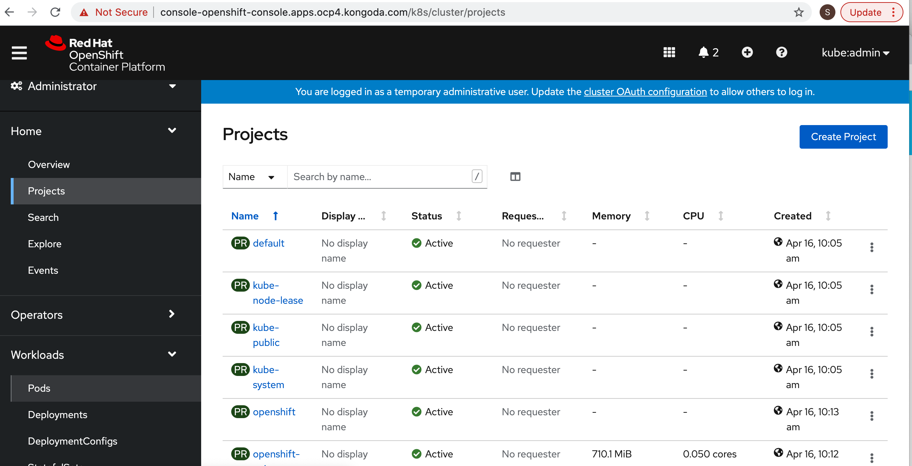

# Automated OpenShift v4 installation on AWS

This project automates the Red Hat OpenShift Container Platform 4.x installation on Amazon AWS platform. It focuses on the OpenShift User-provided infrastructure installation (UPI) where implementers provide pre-existing infrastructure including VMs, networking, load balancers, DNS configuration etc.
However, the scripts have some sane default values and have been able to stand up a Openshift 4.x cluster (validated against 4.7.x) given a _Hosted Zone_.

The core of the scripts are from the [IBM Cloud Repos for Openshift-Terraform](https://github.com/ibm-cloud-architecture/terraform-openshift4-aws). The users are encouraged to refer to the [Redhat Installation for Openshift 4.x](https://docs.openshift.com/container-platform/4.7/installing/installing_aws/installing-restricted-networks-aws.html#logging-in-by-using-the-web-console_installing-restricted-networks-aws), and their accompanying [Openshift 4.x Cloud Formation template](https://github.com/openshift/installer/blob/master/docs/user/aws/install_upi.md), which is essentially the basis for the _Terraform_ equivalent. This file reflects the configuration that has been validated. The original Readme is located [here](./README-IBM-Orig.md)

* [Terraform Automation](#terraform-automation)
* [Infrastructure Architecture](#infrastructure-architecture)
* [Installation Procedure](#installation-procedure)
* [Airgapped installation](#airgapped-installation)
* [Removal procedure](#removal-procedure)
* [Advanced topics](#advanced-topics)

## Terraform Automation

This project uses mainly Terraform as infrastructure management and installation automation driver. All the user provisioned resource are created via the terraform scripts in this project.
Minimal requirement: a user provided _Hosted Zone_ for a _Web Domain_ it owns, in order for the _Openshift_ installation to create _Address_ (A) records for the _subdomains_.

### Prerequisites

1. To use Terraform automation, download the Terraform binaries [here](https://www.terraform.io/). The code here requires Terraform 0.12+, and has been tested with v0.14+;

   On MacOS, you can acquire it using [homebrew](brew.sh) using this command:

   ```bash
   brew install terraform
   ```

2. Install git, or install _VS Code_ or _IntelliJ_ that has embedded support for _git_.

   ```bash
   sudo yum intall git-all
   git --version
   ```

3. Install OpenShift command line `oc` cli:

   ```bash
   wget https://mirror.openshift.com/pub/openshift-v4/clients/ocp/latest/openshift-client-linux-4.x.xx.tar.gz
   tar -xvf openshift-client-linux-4.x.xx.tar.gz
   chmod u+x oc kubectl
   sudo mv oc /usr/local/bin
   sudo mv kubectl /usr/local/bin
   oc version
   ```

4. Install wget command:

    - MacOS:
      ```
      brew install wget
      ```
    - Linux: (choose the command depending on your distribution)
      ```
      apt-get install wget
      yum install wget
      zypper install wget
      ```

4. Get the Terraform code

   ```
   git clone https://gitlab.guardrailz.com/saroj3k/openshift.git
   ```

5. Prepare the DNS

   OpenShift requires a valid DNS domain, you can get one from AWS Route53 or using existing domain and registrar. The DNS must be registered as a Public Hosted Zone in Route53. (Even if you plan to use an airgapped environment)
> Note: A hosted zone for the `domain` must be created in AWS. It's assumed that you are owner of the domain, say `example.com`

6. Prepare AWS Account Access

   Please reference the [Required AWS Infrastructure components](https://docs.openshift.com/container-platform/4.1/installing/installing_aws_user_infra/installing-aws-user-infra.html#installation-aws-user-infra-requirements_installing-aws-user-infra) to setup your AWS account before installing OpenShift 4.

    ```
    export AWS_ACCESS_KEY_ID=RKXXXXXXXXXXXXXXX
    export AWS_SECRET_ACCESS_KEY=LXXXXXXXXXXXXXXXXXX/ng
    export AWS_DEFAULT_REGION=us-east-2
    ```


>   We suggest to create an AWS IAM user dedicated for OpenShift installation with permissions documented above.
>   On the bastion host, configure your AWS user credential as environment variables:
>   Alternatively, configure using a named profile `aws configure <profile>`

## Infrastructure Architecture

For detail on OpenShift UPI, please reference the following:

* [https://docs.openshift.com/container-platform/4.1/installing/installing_aws_user_infra/installing-aws-user-infra.html](https://docs.openshift.com/container-platform/4.1/installing/installing_aws_user_infra/installing-aws-user-infra.html)
* [https://github.com/openshift/installer/blob/master/docs/user/aws/install_upi.md](https://github.com/openshift/installer/blob/master/docs/user/aws/install_upi.md)

The terraform code in this repository supports 3 installation modes:

- External facing cluster in a private network: 
> This installation has been validated for Openshift 4.7.6

- Internal cluster with internet access: 
> Please refer to the original [README](./README-IBM-Orig.md) for installation details.

- Airgapped cluster with no access: 
> Please refer to the original [README](./README-IBM-Orig.md) for installation details.

There are other installation modes that are possible with this terraform set, but we have not tested all the possible combinations, see [Advanced usage](#advanced-topics)

## Installation Procedure

This project installs the OpenShift 4 in several stages where each stage automates the provisioning of different components from infrastructure to OpenShift installation. The design is to provide the flexibility of different topology and infrastructure requirement.

1. The deployment assumes that you run the terraform deployment from a Linux based environment. This can be performed on an AWS-linux EC2 instance. The deployment machine has the following requirements:

    - git cli
    - terraform 0.12 or later
    - wget command

2. Deploy the OpenShift 4 cluster using the following modules in the folders:

 	- route53: generate a private hosted zone using route 53
  - vpc: Create the VPC, subnets, security groups and load balancers for the OpenShift cluster
	- install: Build the installation files, ignition configs and modify YAML files
	- iam: define AWS authorities for the masters and workers
	- bootstrap: main module to provision the bootstrap node and generates OpenShift installation files and resources
	- master: create master nodes manually (UPI)

> Alternatively, provision the cluster by providing the values in [terraform.tfvars](./terraform.tfvars)

Note: the following table should serve as useful guidance

|name | required  | description and value        |
|----------------|------------|--------------|
| `cluster_id` | yes | This id will be prefixed to all the AWS infrastructure resources provisioned with the script - typically using the clustername as its prefix.  |
| `clustername`     | yes  | The name of the OpenShift cluster you will install     |
| `base_domain` | yes | The domain that has been created in Route53 public hosted zone |
| `openshift_pull_secret` | no | The value refers to a file name that contain downloaded pull secret from https://cloud.redhat.com/openshift/install; the default name is `openshift_pull_secret.json` |
| `openshift_installer_url` | no | The URL to the download site for Red Hat OpenShift installation and client codes.  |
| `aws_region`   | yes  | AWS region that the VPC will be created in.  By default, uses `us-east-2`.  Note that for an HA installation, the AWS selected region should have at least 3 availability zones. |
| `aws_extra_tags`  | no  | AWS tag to identify a resource for example owner:myname     |
| `aws_ami` | yes | Red Hat CoreOS ami for your region (see [here](https://docs.openshift.com/container-platform/4.2/installing/installing_aws_user_infra/installing-aws-user-infra.html#installation-aws-user-infra-rhcos-ami_installing-aws-user-infra)). Other platforms images information can be found [here](https://github.com/openshift/installer/blob/master/data/data/rhcos.json) |
| `aws_secret_access_key` | yes | adding aws_secret_access_key to the cluster |
| `aws_access_key_id` | yes | adding aws_access_key_id to the cluster |
| `aws_azs` | yes | list of availability zones to deploy VMs |
| `aws_publish_strategy` | no | Whether to publish the API endpoint externally - Default: "External" |
| `airgapped` | no | A map with enabled (true/false) and repository name - This must be used with `aws_publish_strategy` of `Internal` |


See [Terraform documentation](https://www.terraform.io/intro/getting-started/variables.html) for the format of this file.

### Deploying the cluster

Initialize the Terraform:

```bash
terraform init
```
> Note: 1. `terraform` versions later than v0.12 may require newer _elements, structure and providers_. 2. `Openshift 4.6+` require `ignition v3.x` which is not officially available from _Terraform_ nd therefore, a community build may need to be employed

Run the terraform provisioning:

**Step 1** Dry run showing required resource Profile

```bash
terraform plan -var "aws_access_key_id=$AWS_ACCESS_KEY_ID" -var "aws_secret_access_key=$AWS_SECRET_ACCESS_KEY" -var "aws_profile=$AWS_PROFILE"
```
> To avoid embedding the secret credential in the file, pass them as parameters, example
> Note: 1) Unix interprets single and double quotes differently, so do note to enclose in double quotes
>       2) Plan file. when applying from a plan file, it does not refresh the local state, which can be problematic on a restart from a failure.

**Step 2** Install Openshift Cluster

```
terraform apply -var "aws_access_key_id=$AWS_ACCESS_KEY_ID" -var "aws_secret_access_key=$AWS_SECRET_ACCESS_KEY" -var "aws_profile=$AWS_PROFILE"
```

**Step 3** Optionally include versions of `oc` and `kubectl` _CLI_  in the path by creating _symbolic links_

```
cd /usr/local/bin (or windows equivalent of a folder included in the path _env_ variable)
ln -s <path of this folder>/install/oc oc
ln -s <path of this folder>/install/kubectl kubectl
oc version (to validate the availability of the command in the environment)
kubectl version (to validate the availability of the command in the environment)
```
## Validate Installation
The `oc` CLI (and web console) should be the recommended mechanism to access an Openshift cluster including the installation in AWS

> Log on to the Openshift Cluster using `kubeadmin` account is not recommended in PROD, and should be removed once installation is complete.
> Further, accessing the cluster _nodes_ using `ssh` is also discouraged, as it flags the nodes as tainted.
>_Operators_ are the recommended mechanism to affect any changes and ensure immutability.

The following is an excerpt from the [Validating an installation](https://docs.openshift.com/container-platform/4.7/installing/validating-an-installation.html#validating-an-installation)

**Log on**
```
oc login https://api.ocp4.kongoda.com:6443 -u kubeadmin -p <kubeadmin-password file content>
```
**Get Lay of the land**
```
oc get nodes
```
**Resource usage**
```
oc adm top nodes
```
**Explore Namespaces**
```
oc projects
oc project <namespace>
```
**Get address for web console as alternative to `oc`**
```
oc routes
oc get routes -n openshift-console | grep 'console-openshift'
```
**Access the _web console_ from the browser**
A sample screenshot is given below 

### Removing bootstrap node

Once the cluster is installed, the bootstrap node is no longer used at all. One of the indication that the bootstrap has been completed is that the API load balancer target group shows that the bootstrap address is `unhealthy`.

```
terraform destroy -target=module.bootstrap.aws_instance.bootstrap -var "aws_access_key_id=$AWS_ACCESS_KEY_ID" -var "aws_secret_access_key=$AWS_SECRET_ACCESS_KEY" -var "aws_profile=$AWS_PROFILE"
```

## Removal Procedure

For the removal of the cluster, there are several considerations for removing AWS resources that are created by the cluster directly, but not using Terraform. These resources are unknown to terraform and must be deleted manually from AWS console.
Some of these resources also hamper the ability to run `terraform destroy` as it becomes a dependent resource that prevent its parent resource to be deleted.

The cluster created resources are:

- Resources that prevents `terraform destroy` to be completed:
  - Worker EC2 instances
  - Application Load Balancer (classic load balancer) for the `*.apps.<cluster>.<domain>`
  - Security Group for the application load balancer
- Other resources that are not deleted:
  - S3 resource for image-registry
  - IAM users for the cluster
  - Public Route53 Record set associated with the application load balancer

> Therefore, it's advisable to terminate the EC2 instances and a few other network infrastructure using AWS console before executing the _Terraform Destroy_
```
terraform destroy -var "aws_access_key_id=$AWS_ACCESS_KEY_ID" -var "aws_secret_access_key=$AWS_SECRET_ACCESS_KEY" -var "aws_profile=$AWS_PROFILE"
```
> Optionally, run the following utility script to confirm the removal of all the resources; otherwise, rerun the `terraform destroy`
```
./list-vpc.sh <vpc id or a nonce> <aws profile>
```

## Cost

Now, the inevitable question: How much will it cost me? Per experience, the total cost for the cluster will be roughly 2-3 USD/hour (~= 0.35 dollar/t2 or i3 instance/hour)

## Airgapped Installation

This has not been validated, and please refer to the [Original Readme](./README-IBM-Orig.md) for installation instruction.

## Advanced topics

Additional configurations and customization of the implementation can be performed by changing some of the default variables.
You can check the variable contents in the following terraform files:

- variable-aws.tf: AWS related customization, such as machine sizes and network changes
- config.tf: common installation variables for installation (not cloud platform specific)

**Note**: Not all possible combinations of options has been tested - use them at your own risk. 
